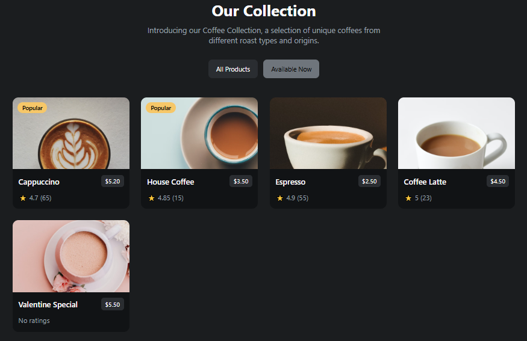
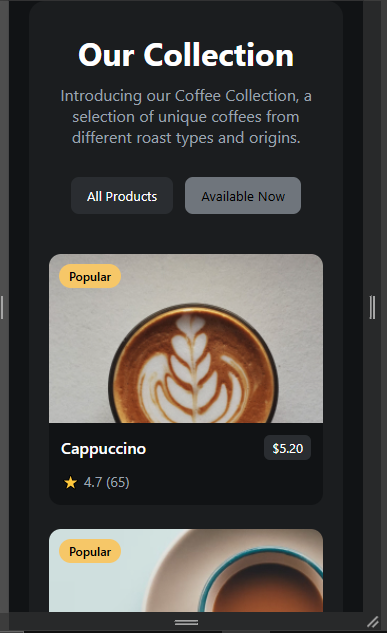

#  Simple Coffee Listing

Proyecto frontend desarrollado con **React + Vite**, basado en el challenge de **devChallenges**, que consume una API externa y muestra un catálogo de cafés con filtros diseño responsive.

---

## Integrantes
Milton Ramiro Luna Chasoy

##  Capturas

### 💻 Vista Desktop

### 📱 Vista Mobile

---

## 🛠 Tecnologías

-  React
-  Vite
-  CSS puro
-  Fetch API
-  Arquitectura por componentes

---

## Instalacion y Ejecucion

1. Clonar el repositorio localmente
- https://github.com/Milton-Luna/simple-coffee.git
2. Instalar dependencias 
- npm install
3. Ejecutar en desarrollo 
- npm run dev
4. Build de producción
- npm run build
5. API utilizada
- https://raw.githubusercontent.com/devchallenges-io/curriculum/refs/heads/main/4-frontend-libaries/challenges/group_1/data/simple-coffee-listing-data.json

